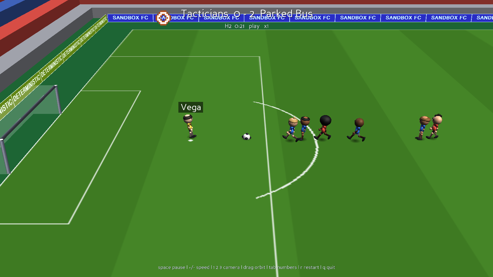

# fussball

A 5-a-side football simulator where both teams are driven by Python scripts.
Four outfield players plus a goalkeeper per side. You supply two scripts, one
per team; each gets the state of the game every tick and returns an action for
each of its five players. The same match can be watched top-down or from a
pitch-side 3D camera.

Engine: **pygame-ce** (free, LGPL). The simulation itself is flat — players move
in two dimensions and only the ball has height — and it is pure Python, so team
scripts are imported directly: no IPC, no serialisation, and a match replays
bit-for-bit given the same seed.



## Setup

```bash
cd fussball
python3 -m venv .venv
.venv/bin/pip install pygame-ce
```

## Run a match

```bash
.venv/bin/python -m football bots/tactician.py bots/chaser.py
```

First argument is the home team, second is away. That opens the 2D viewer.
For the 3D view:

```bash
.venv/bin/python -m football bots/tactician.py bots/chaser.py --view 3d
```

| key | 3D view |
|-----|---------|
| `1` `2` `3` | broadcast / follow-ball / high camera |
| left drag | orbit |
| wheel | zoom |
| `space` `+` `-` `tab` `r` `q` | as below |

The 2D view is still the debugging view — it draws control radii and velocity
vectors, and needs no GPU.


### Dressing the stadium

```bash
--ads DIR            # images for the pitch-side hoardings
--centre-logo FILE   # painted on the centre circle (both views)
```

`--ads` takes a folder of images. **Animated GIFs play** if Pillow is installed
(`pip install pillow`); without it they show their first frame, and stills work
either way. Each image is letterboxed onto a board-shaped canvas, so it is not
distorted. Leave the flag off and four built-in boards are used, one of which
animates.

The perimeter is split into four runs — two touchlines, two ends — each showing
one ad, staggered so the ring is not one synchronised wall. Every board in a run
shares a texture, so a run costs a single draw call. Boards all face the pitch,
as real hoardings do: you read the far side, and the near side shows the plain
dark backs.

`--centre-logo` is blended into the turf rather than laid over it, so it reads
as painted on the grass — and because both renderers share the pitch drawing,
it shows up in the 2D view too.

Players in the 3D view are articulated — hips, knees, shoulders and elbows —
and animated procedurally rather than from a rigged model, because Panda bundles
only primitives and an animated panda. The run cycle is keyed to
`Player.distance_run`, the same quantity the 2D sprite uses, so the stride stays
in step with actual ground speed instead of sliding against it; arms
counter-swing, the body bobs and leans, and a strike plays off `kick_cd`, which
already decays at exactly the right rate. The ball rolls by the distance it has
travelled, which is what its panels are for.

Two things are worth knowing if you extend it. Geometry **must carry normals**
or lighting silently does nothing — Panda's own `models/misc/sphere` has none,
which is why the shapes here are generated rather than loaded. And
`getSupportsBasicShaders()` is false on macOS, so `setShaderAuto()` gives no
per-pixel lighting: this uses the fixed-function pipeline, and real shadows
would need hand-written GLSL (which does compile in a `gl-version 3 2` context,
if you want to try).


| key | action |
|-----|--------|
| `space` | pause / resume |
| `+` / `-` | simulation speed (0.125x … 16x) |
| `tab` | debug overlay — shirt numbers, stamina rings, velocities, control radii, per-bot think times |
| `s` | single-step one tick while paused |
| `r` | restart with the next seed |
| `q` / `esc` | quit |

Players are drawn as top-down figures — shirt, shorts, boots and a head, with
legs striding in time with the distance they actually cover, and skin and hair
varying per player. Sprites are rendered at 4x and scaled down, since pygame's
primitives are hard-aliased and look crude at ~20 px per player. Players and
the ball are drawn larger than true scale; at 105 m across a real player is a
5 px smudge, so top-down football games have always exaggerated this.

Diagnostic clutter (shirt numbers, stamina rings) lives behind `tab` rather
than on the plain view.

Useful flags:

```bash
--headless          # no window, just simulate and print the result
--matches 20        # play a 20-match series and print the aggregate
--minutes 3         # length of each half (default 90 simulated seconds)
--periods 1         # number of halves
--seed 42           # same seed => identical match, every time
--speed 4           # start the viewer at 4x
--window 1440x900
```

Batch-test two bots against each other:

```bash
.venv/bin/python -m football bots/tactician.py bots/parked_bus.py --matches 20
```

## Writing a team

A team script defines a subclass of `football.api.Team`:

```python
from football.api import Team, Action

class MyTeam(Team):
    name = "My Team"
    player_names = ("Vega", "Ferro", "Marek", "Oyelaran", "Bruhn")  # optional

    def act(self, state):
        # return one Action per player, index 0..4 (0 is always the keeper)
        return {p.index: Action.go_to(p, state.ball.pos, sprint=True)
                for p in state.us}
```

### Your club crest

Add a `logo` and it appears beside your team name in the 3D view:

```python
class MyTeam(Team):
    name = "Tacticians"
    logo = ("..HHH..",
            ".HWWWH.",
            "HW...WH",
            ".HWWWH.",
            "..HHH..")
    logo_colors = {"H": "#1f4fa8", "W": "#eef3ff"}
```

A grid of characters plus a palette, max 24×24, where `.` and space are
transparent. Colours are `#rgb`, `#rrggbb` or `(r, g, b[, a])`.

It is a pixel grid rather than an image file for two reasons: your bot stays a
single self-contained script with no assets beside it, and **the host never runs
an image decoder over bytes that came from untrusted code**. The crest crosses
the sandbox boundary as plain text and is re-validated host-side with the same
parser the trusted path uses — a malformed crest is dropped, never fatal.

`player_names` is optional — omit it and your squad gets a default roster.
Index 0 is the keeper. Short names read best: the name of whoever has the ball
is drawn on a plate above their head in the viewer, and every `PlayerView` also
carries `.name`, which is handy in your own logging. Blank or missing entries
fall back per-slot, so a partial list is fine.

Alternatives the loader also accepts: a `create_team()` factory, or a plain
module-level `act(state)` function (see `bots/parked_bus.py`).

**Everything is in your own frame of reference.** Your team always attacks +x,
`state.us` is always your five players, index 0 is always your keeper. The same
script plays identically at home or away — the engine mirrors the world for the
away team and mirrors its actions back.

### What you get — `state`

```python
state.ball.pos / .vel / .speed      # Vec2 on the ground plane, metres and m/s
state.ball.height                   # metres above the turf; 0.0 when grounded
state.ball.vertical_speed           # positive is rising
state.ball.airborne
state.ball.loose                    # nobody is in possession
state.ball.owned_by_us / _by_them
state.predict_ball(0.4)             # where it will be in 0.4 s, bounces included
state.us / state.them               # 5 PlayerViews each; [0] is the keeper
state.pitch                         # dimensions, our_goal, their_goal, posts
state.our_score / their_score
state.phase                         # play | setpiece | kickoff | goal | ...
state.setpiece, state.setpiece_is_ours
```

Each `PlayerView` has `pos`, `vel`, `heading`, `name`, `stamina`, `is_keeper`,
`has_ball`. Handy helpers on `state`:

```python
state.closest_to_ball()             # your nearest outfield player
state.nearest_opponent_to(point)
state.pressure_on(point, radius)    # 0.0 = free, grows as opponents crowd it
state.lane_is_clear(start, end)     # is a pass/shot lane open?
state.opponents_within(point, r)
state.can_trap(me)                  # could this player collect the ball now?
state.can_reach(me)                 # is it low enough to touch at all?
```

`state.limits` exposes the engine constants you are allowed to plan against —
`trap_speed`, `control_radius`, `kick_reach`, `tackle_radius`, `run_speed`,
`max_kick_speed`, `ball_friction` and friends — plus two helpers:

```python
state.limits.power_for(distance, arrive_speed=6.0)  # weight a pass to be catchable
state.limits.reach_of(power)                        # how far a kick will roll
```

Read constants from here rather than hard-coding them, so your bot still works
if the rules are retuned.

### What you return — `Action`

```python
Action.go_to(me, target, sprint=True)             # run somewhere
Action.intercept(me, ball_at, kick_target)        # run at the ball, strike on arrival
Action.kick_to(me, target, power, lift=0.0)       # stand and strike (power 0..1)
Action.pass_to(me, mate, power, lift=0.0)         # leads the receiver
Action.dribble(me, target, power)                 # knock it ahead into space
Action.idle()
```

Raw fields if you want them: `move` (direction, length ≤ 1 scales speed),
`sprint`, `kick` (direction), `kick_power`, `lift`, `catch` (keeper only, in
your box).

`lift` (0..1) launches the ball upward, up to about 54° at 1.0. It is how you
go *over* people — but it costs you: an airborne ball travels less far for the
same power and **nobody can trap it until it comes down**, so lofting by habit
just hands possession to whoever is standing where it lands.

Three things worth knowing. They are the difference between a bot that plays
football and one that just knocks the ball about:

- **Gather or strike is your biggest decision.** A ball closing faster than
  `limits.trap_speed` (10 m/s) cannot be collected — it rebounds off you. Kicks
  work at any speed, so a fast ball can only be struck. Decide from
  `state.can_trap(me)`, *not* from where the ball is. Getting this wrong is
  what made the reference bot lose 0–27 before it was fixed.
- **The ball follows whoever owns it**, so a plain `go_to` already dribbles, and
  carrying is strong: a carrier cannot be kicked off the ball, only tackled, and
  only by the single nearest opponent. Sprinting away from that opponent roughly
  halves their chance. Winning the ball in a crowd and immediately passing into
  that same crowd is how you give it straight back.
- **A kick fires the moment the ball is within reach (1.6 m).** That is further
  than the control radius (1.1 m), so a player who sets a kick every tick will
  never gain possession — it just batters the ball away. Set a kick when you
  mean to pass, shoot or clear, and use `limits.power_for(distance)` for passes
  so they arrive slow enough for a team-mate to actually trap.

### Intercepting

Worth understanding, because it is not obvious from the API. A ball passing
near a player resolves one of three ways:

- **Trapped** — within 1.1 m, arriving slower than 10 m/s *relative* to them,
  **and below 0.55 m off the ground**: they gain possession.
- **Deflected** — within 1.1 m but faster: it rebounds off them and stays loose.
  They become the last toucher, which decides corners vs goal kicks.
- **Untouched** — beyond 1.1 m laterally it simply goes past. At 1.3 m off the
  lane, nothing happens at all.

Consequences worth designing around:

- Pace is a trade-off. A pass above ~10 m/s cannot be cleanly picked off, only
  blocked into a loose ball.
- Closing head-on *hurts*: sprinting at a 14 m/s pass deflects it where standing
  still would have trapped it, because relative speed is what counts. Read the
  pass and arrive early rather than charging it.
- A kick fires from 1.6 m — wider than the 1.1 m control radius — so
  `Action.intercept` can strike a fast pass that could never have been trapped.
- Keepers are far better at it: 2.0 m reach and a 15 m/s trap limit.
- Height gates everything. Below 0.55 m you can trap it; up to 2.6 m you can
  still head or volley it; above that it is out of reach entirely and sails
  past untouched. Keepers reach 2.95 m.

Your bot cannot crash the match: exceptions are caught, that tick's players
idle, and the first few tracebacks are printed. Per-tick timings are reported
at full time and in the `tab` overlay.

## Running untrusted bots

Team scripts are arbitrary Python, so **bots run sandboxed by default**, each in
its own process. Use `--trusted` to run in-process instead — faster and easier
to debug, but a script can then do anything you can, so keep it for code you
wrote yourself.

```bash
python -m football theirs.py mine.py                  # sandboxed (default)
python -m football mine.py mine.py --trusted          # in-process, no sandbox
python -m football a.py b.py --tick-timeout 0.5       # more thinking time
python -m football a.py b.py --no-os-sandbox          # skip the seatbelt profile
```

What a sandboxed bot cannot do, all verified against bots that actually try it:

| attack | outcome |
|---|---|
| open a socket | refused at load — `socket.__new__` blocked |
| write a file | refused — audit hook, plus `RLIMIT_FSIZE=0` and a deny-write profile |
| read `$HOME` | refused — read allowlist, plus a scrubbed `HOME` |
| spawn a process | refused — `subprocess.Popen` blocked |
| steal env vars | nothing to steal: the child gets a stripped environment |
| infinite loop in `act()` | killed after `--tick-timeout` (0.25 s), team plays on idle |
| fork bomb | contained; no process growth |
| allocate 2 GB | killed — `RLIMIT_AS` |
| return `NaN` to corrupt the pitch | scrubbed at the trust boundary |

The layers, weakest to strongest:

1. **An audit hook** (`sys.addaudithook`) blocking network, subprocess, writes,
   `ctypes` and out-of-tree reads. Installed *before* the bot is imported,
   because a team script runs code at import time. Audit hooks cannot be
   uninstalled once set, but this is a guardrail, **not** a boundary — given
   arbitrary Python, a determined attacker gets past it.
2. **Process limits** — `RLIMIT_FSIZE`, `RLIMIT_AS`, `RLIMIT_CPU`, `RLIMIT_NOFILE`
   — plus a stripped environment and a host-side wall-clock kill.
3. **An OS sandbox profile.** On macOS, a `sandbox-exec` seatbelt denying
   network and all writes. This is the layer that actually holds.

The host treats every byte from a bot as hostile: JSON only (**never `pickle`** —
unpickling attacker bytes in the host would undo the whole design), a size cap
on replies, and strict validation of type, range and finiteness before anything
reaches the simulation.

**Known limits, stated plainly.** On Linux and Windows only layers 1 and 2
apply — there is no seccomp, namespace or Job Object support here yet, so an
escape from the Python-level guardrail has the process's own privileges. If you
are hosting a public league, run the whole thing in a container
(`--network none --read-only --cap-drop ALL --pids-limit`) and treat the
in-process defences as depth, not as the wall. Sandboxing costs about 2.8x on a
headless match (5.4 s vs 1.9 s for a full 2×90 s game) and is invisible in the
viewer. Results are bit-identical either way.

## The model

- 105 × 68 m pitch, fixed 1/60 s timestep, seeded RNG → deterministic replays.
- **The ball has real height.** It flies, is pulled down by gravity, bounces
  off the turf and comes off the posts and crossbar. Only the ball leaves the
  ground: players stay two-dimensional and are given a vertical *reach*
  instead, which is why positions are `Vec2` everywhere. A shot only counts if
  it is under the bar; over it is a goal kick.
- Players accelerate toward a desired velocity; sprinting drains stamina, which
  lowers top speed until it recovers.
- **Possession**: the nearest player within 1.1 m takes control, but only if the
  ball is travelling slower than ~10 m/s relative to them. Anything faster
  rebounds off them — which is what keeps shots and clearances alive instead of
  being swallowed by the first body they pass.
- **Duels**: only the nearest opponent challenges the carrier, at ~1.9
  attempts/second. (Letting every nearby opponent roll its own tackle made
  swarming the ball strictly dominant.) That rate is then scaled by two things:
  how fast the carrier is moving directly away from the challenge, and the
  stamina gap between the two players — a fresh player robbing a spent one is
  40% more likely to win it, and 40% less the other way. In the extreme, a
  spent carrier jogging clear loses the ball ~3.4x faster than a fresh one
  sprinting clear.
- **Keeper**: can catch inside its own penalty area with `catch=True`. Shots
  above ~17 m/s are parried rather than held. The six-second rule is enforced —
  a keeper in possession in its own box is released automatically and cannot
  pick the ball up again for 2.5 s.
- **Restarts**: goals, throw-ins, corners and goal kicks, awarded on last touch.
  Opponents are cleared 4.5 m from a set piece.
- Not modelled: offside, fouls, cards, the goal frame itself.

Every constant lives in `football/config.py` as a `Rules` dataclass.

## Example bots

| bot | style |
|-----|-------|
| `bots/chaser.py` | everyone runs at the ball and shoots — the naive baseline, and a ~25-line API example |
| `bots/tactician.py` | role-based: zonal shape, two-man press, man-marking, carrying, passing and shot selection |
| `bots/parked_bus.py` | deep defensive block, long counters; written as a plain `act()` function |

They exist to demonstrate the API and to give you something to play against,
not as a skill ladder. Over 72 matches they average ~2.2 goals per match.

`chaser.py` is deliberately the dumbest and is nonetheless the strongest —
swarming the ball with four players wins duels and pins the opponent in their
own half. That looks like a bug in the reference bot but is mostly a real
property of five-a-side: if you want positional play to beat it, that is a
question about the rules in `config.py`, not about the bots.

## Tests

```bash
.venv/bin/python -m pytest                    # everything, ~5 s
.venv/bin/python -m pytest -m "not slow"      # skip the sandbox process tests
```

170 tests. They are written around the failures this codebase actually had,
not around line coverage — most of them exist because something once went
wrong in exactly that place:

| file | guards |
|------|--------|
| `test_physics.py` | rolling, flight, bounce decay, the crossbar and the posts |
| `test_possession.py` | fast balls rebounding rather than being vacuumed up, height gating, the keeper's six-second rule, only the nearest opponent challenging |
| `test_laws.py` | throw-ins, corners, goal kicks, scoring, and the mirrored view each team is handed |
| `test_api.py` | NaN and infinity scrubbing, weighted passes, prediction agreeing with the engine, hostile crests |
| `test_protocol.py` | the wire format carrying ball height and lift, and `decode_actions` fed rubbish |
| `test_determinism.py` | identical replays, and bots that return junk, raise, or flood the engine |
| `test_loader.py` | every accepted bot shape, and containment of broken ones |
| `test_render.py` | pitch markings, the name-plate tracker, ad clips, and that generated geometry carries **normals** |
| `test_sandbox.py` | bots that really do try to open sockets, write files, read `$HOME`, fork, hang and exhaust memory |

Two are worth knowing about. `test_render.py` asserts generated geometry has a
normal column, because lighting fails *silently* without one — that is how
everything came to be flat-shaded. And `test_sandbox.py` proves the sandboxed
and trusted paths play byte-identical matches, which is what catches the wire
format falling behind the engine.

## Layout

```
football/
  api.py       what bots import: Team, Action, GameState, Vec2
  engine.py    the simulation — physics, possession, laws of the game
  config.py    every tunable constant
  loader.py    imports a team script, contains its crashes, times it
  render.py    pygame viewer
  cli.py       argument parsing, headless and batch modes
bots/          example teams
```
